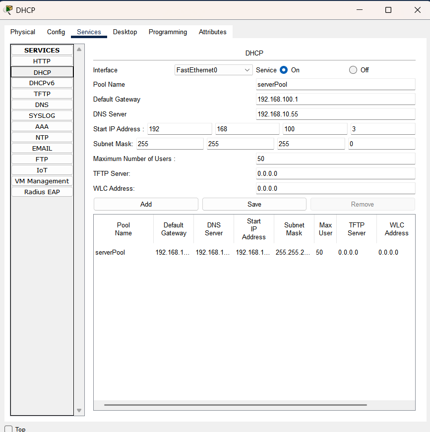

# Smart Software House Network Simulation 🏢🌐

This project demonstrates the design and implementation of a **Smart Software House network** using **Cisco Packet Tracer**.  
The network integrates **enterprise networking features** with **modern IoT services**, ensuring robust communication, scalability, and innovation.

> **Course:** Computer Networks (4th Semester)  
> **Tool Used:** Cisco Packet Tracer  
> **Focus:** VLANs, Inter-VLAN Routing, RIP, NAT, DHCP, Servers, IoT, and Wireless Access

---

## 🔧 Tools & Technologies
- Cisco Packet Tracer 8.x
- Routers & Multilayer Switches
- RIPv2 (Routing Information Protocol)
- DHCP, DNS, FTP, Email, HTTP Servers
- Dynamic NAT
- IoT Gateway + Smart Devices
- Wireless Access Point (WAP)
- CLI tools (`ping`, `tracert`, `show` commands)

---

## 📂 Project Files
- `Smart-Software-House.pkt` – Main simulation file  
- `/report/Smart-Software-House-Report.pdf` – Final detailed report  
- `/assets/screenshots/` – Network topology, configurations, and tests  

---

## 🧪 What’s Demonstrated

### 🗂 VLANs & Inter-VLAN Routing
- VLAN segmentation for departments  
- Inter-VLAN routing on the multilayer switch  

### 🔁 RIP Routing
- Dynamic route exchange across routers using RIPv2  

### 💻 DHCP & Core Servers
- DHCP for automatic IP assignment  
- DNS, HTTP, FTP, and Email services configured and tested  

### 🌍 Dynamic NAT
- Translating internal IPs to public for external communication  

### 📱 IoT & Wireless Connectivity
- IoT gateway managing smart devices (fans, ACs)  
- Laptops and mobiles connected via WAP  

---

## 📘 Key Learning
- Enterprise-level network design with VLANs and dynamic routing  
- Server deployment and service validation  
- NAT configuration for real-world internet access  
- IoT integration into traditional networks  
- Wireless connectivity in enterprise setups  

---

## 📸 Screenshots
<p float="left">
  
  
  
</p>

<p float="left">
  
  
  
</p>

<p float="left">
  
  
  
</p>

<p float="left">
  
  
</p>

*(More screenshots are available in the `assets/screenshots/` folder.)*

---

## 📥 How to Run

1. **Clone the repository:**
   ```bash
   git clone https://github.com/Sameed-333/smart-software-house-network.git

2. **Navigate to the project folder:**
    ```bash
    cd smart-software-house-network

3. **Open the simulation file:**
    - Launch Smart-Software-House.pkt in Cisco Packet Tracer.

4. Explore the simulation:
    - View the network topology and device layout.
    - Use CLI on routers and the multilayer switch:
    ```bash
    show ip route
    show vlan brief
    show running-config
    ```
    - Verify DHCP leases on PCs (Desktop → IP Configuration).
    - Test servers:
        - Open browser for HTTP server.
        - Use command prompt for ping/tracert.
        - Access FTP service with put, get, rename.
        - Send/receive mail via the Email server.
    - Control IoT devices (fan/AC) from laptop/mobile via the IoT Gateway.

5. Review the report:
    - Open /report/Smart-Software-House-Report.pdf for:
        - Addressing details   
        - Configurations
        - Service verification
        - Learning outcomes

---

### ⚠️ Disclaimer

This project was created for educational purposes only as part of a university networking course.
It simulates enterprise networking features (servers, NAT, VLANs, IoT, wireless) in a controlled Packet Tracer environment and is not intended for production use.